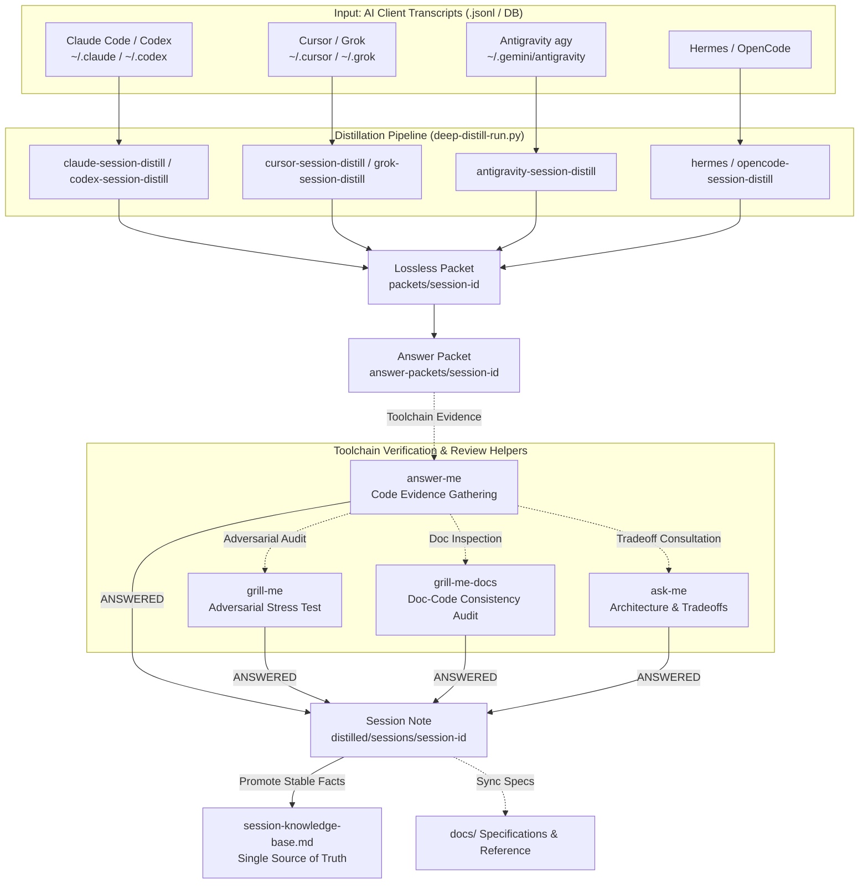

# Session Distill Skills

Distill raw AI session transcripts (Claude Code, Codex, Cursor, Grok, Hermes, Antigravity, OpenCode) into structured, verifiable repository knowledge.

[中文文档 (Chinese Documentation)](README_zh.md)

## Architecture



## Core Distillation Paradigm (Deep Distill)

All 7 supported platforms execute identical post-processing rules via `shared/deep_distill_lib.py`:

1. **Batching**: Process 3 sessions per batch (`deep-distill-run.py --batch-size 3`).
2. **Compact Manifest Ingest**: Bounded exchange manifest (≤3000 Tokens) generated for fast exchange lookup.
3. **Answer Packet Gate**: Hypotheses -> Question Table -> Toolchain Verification -> Only `ANSWERED` rows promote to KB.
4. **Temporal Staleness Audit**: Verify claims against the current codebase HEAD; mark outdated facts `STALE` or `CONTRADICTED`.
5. **Check-work Report**: Audit report generated at `distilled/check-work/batch-*-report.md` before raw session purge.

## Supported Adapters

| Adapter | Platform | Source Format |
|---|---|---|
| `claude-session-distill` | Claude Code | `.jsonl` |
| `codex-session-distill` | Codex | Archived DB / JSONL |
| `cursor-session-distill` | Cursor | SQLite + JSONL |
| `grok-session-distill` | Grok CLI | `chat_history.jsonl` |
| `hermes-session-distill` | Hermes | SQLite `state.db` |
| `antigravity-session-distill` | Antigravity (agy) | `history.jsonl` + brain transcripts |
| `opencode-session-distill` | OpenCode | `storage/session` JSON tree |

## Installation

PowerShell One-Click Installer:

```powershell
.\shared\install.ps1 -Platforms cursor,grok,hermes,antigravity
```

## License & Contributing

See [CONTRIBUTING.md](CONTRIBUTING.md) for testing guidelines and pull request checks.
