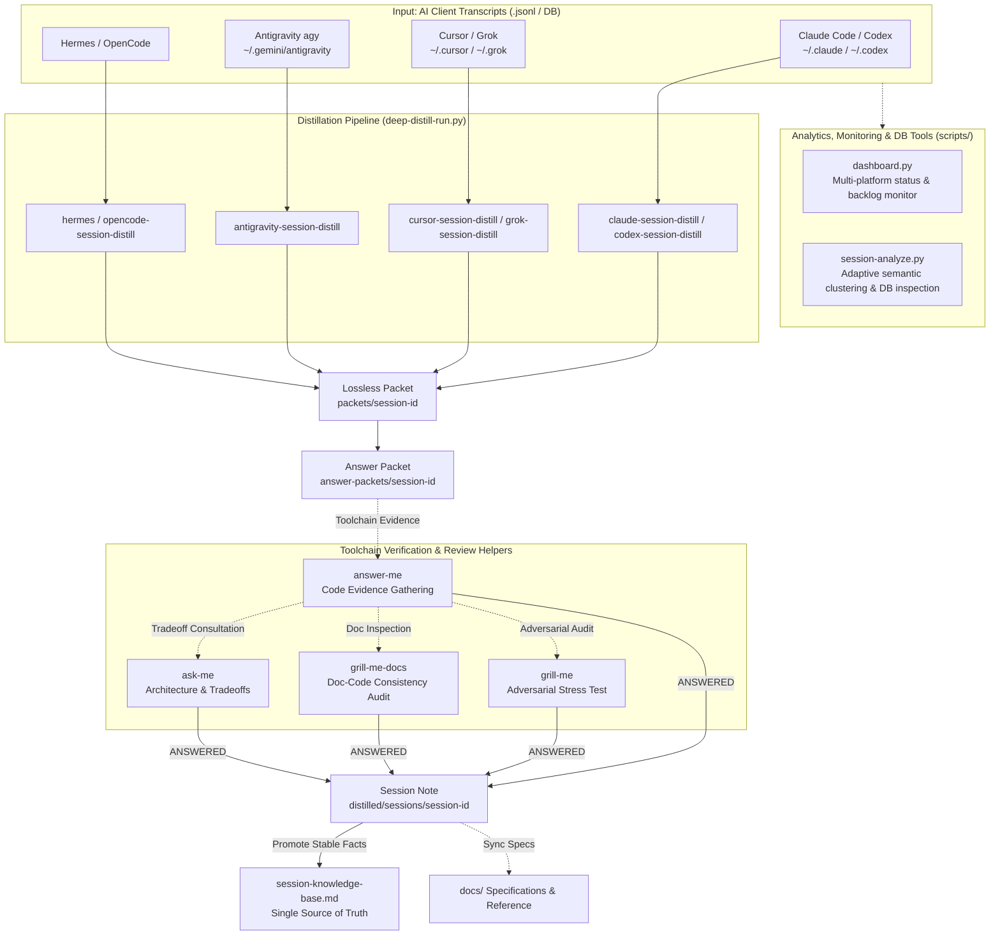

# Session Distill Skills

Distill raw AI session transcripts (Claude Code, Codex, Cursor, Grok, Hermes, Antigravity, OpenCode) into structured, verifiable, temporal-staleness-free repository knowledge.

[中文文档 (Chinese Documentation)](README_zh.md)

---

## Architecture Overview



---

## CLI Utilities (`scripts/`)

The repository provides a complete set of operational and analytical command-line utilities:

### 1. Unified Dashboard (`scripts/dashboard.py`)
Monitor session totals, packets, answer packets, distilled sessions, and pending backlogs across all 7 supported AI platforms:
```bash
# Global status across all platforms
python scripts/dashboard.py

# Filter by target workspace/project
python scripts/dashboard.py --project servers
```

### 2. Multi-Project Adaptive Semantic Analysis & Storage Inspector (`scripts/session-analyze.py`)
Provides auto-adaptive taxonomy clustering (Backend, Frontend, Reverse Engineering), Cursor SQLite DB inspection, and safe pruning of processed sessions:

```bash
# 1. Analyze backend server sessions (8 backend domains)
python scripts/session-analyze.py --project servers

# 2. Analyze frontend / client sessions (auto-switches to UI/Gameplay/Asset/Protocol, skips empty drafts)
python scripts/session-analyze.py --project code --active-only

# 3. Analyze reverse engineering sessions (Decompile/Crypto/Protocol)
python scripts/session-analyze.py --project com-ican-raz

# 4. Inspect Cursor SQLite physical storage, workspaces, and DiskKV distribution
python scripts/session-analyze.py --inspect-db

# 5. Clean processed raw session files for a specific project (Dry-run and Execution)
python scripts/session-analyze.py --project servers --clean-processed
python scripts/session-analyze.py --project servers --clean-processed --execute
```

#### Taxonomy Profiles

| Profile | Target Stack | Domains |
|---|---|---|
| **`backend`** | Servers, NestJS, Microservices | Payment & Commerce, Auth & User & SMS, Partner & Attribution & Marketing, Activity & Gameplay & Config, Database & Migration, Deployment & Ops & Infra, Multi-Product Architecture, Git & Code Review |
| **`frontend`** | Unity, Web, App Clients | UI & Visual & Animation, Gameplay & Battle Engine, Asset & Resource Pipeline, Network & Protocol Sync, Build & Platform SDK, Git & Code Review |
| **`reverse`** | APK/DEX Unpack, Protocol Audit | Decompile & DEX Recovery, Resource & Asset Extraction, Crypto & Sign & Security, Network Contract & API Reversal, Git & Automation Tooling |

### 3. Comprehensive Test Suite (`scripts/run-all-tests.py`)
Executes all regression suites (7 platform adapter self-tests + contract tests + utility self-tests + local hardcoded path defenses):
```bash
python scripts/run-all-tests.py
```

### 4. Shared Library Distributor (`scripts/sync-shared.py`)
Distributes core files from `shared/` to platform adapter directories and validates consistency:
```bash
python scripts/sync-shared.py --check
python scripts/sync-shared.py
```

---

## Core Distillation Paradigm (Deep Distill)

All supported platforms execute identical post-processing rules via `shared/deep_distill_lib.py`:

1. **Batching**: Process small batches (`deep-distill-run.py --batch-size 3`).
2. **Compact Manifest Ingest**: Bounded exchange manifest (≤3000 Tokens) generated for fast exchange lookup.
3. **Answer Packet Gate**: Hypotheses -> Question Table -> Toolchain Verification -> Only `ANSWERED` rows promote to KB.
4. **Temporal Staleness Audit**: Verify claims against the current codebase HEAD; mark outdated facts `STALE` or `CONTRADICTED`.
5. **Check-work Report**: Audit report generated at `distilled/check-work/batch-*-report.md` before raw session purge.

---

## Supported Adapters

| Adapter | Platform | Source Format | Query / Index Optimization |
|---|---|---|---|
| `claude-session-distill` | Claude Code | `.jsonl` | Structured session scanner |
| `codex-session-distill` | Codex | Archived DB / JSONL | JSONL turn reconstruction |
| `cursor-session-distill` | Cursor | SQLite (`state.vscdb`) + JSONL | B-Tree prefix range query (0.05ms) + empty-draft filter |
| `grok-session-distill` | Grok CLI | `chat_history.jsonl` | Multi-turn transcript splitter |
| `hermes-session-distill` | Hermes | SQLite `state.db` | Memory session & state machine extractor |
| `antigravity-session-distill` | Antigravity (agy) | `history.jsonl` + brain transcripts | Trajectory and artifact mapping |
| `opencode-session-distill` | OpenCode | `storage/session` JSON tree | Multi-workspace tree parser |

---

## Installation

PowerShell One-Click Installer:

```powershell
.\shared\install.ps1 -Platforms cursor,grok,hermes,antigravity
```

---

## License & Contributing

Before submitting pull requests, ensure all test suites pass:
```bash
python scripts/run-all-tests.py
```
See [CONTRIBUTING.md](CONTRIBUTING.md) for details.
