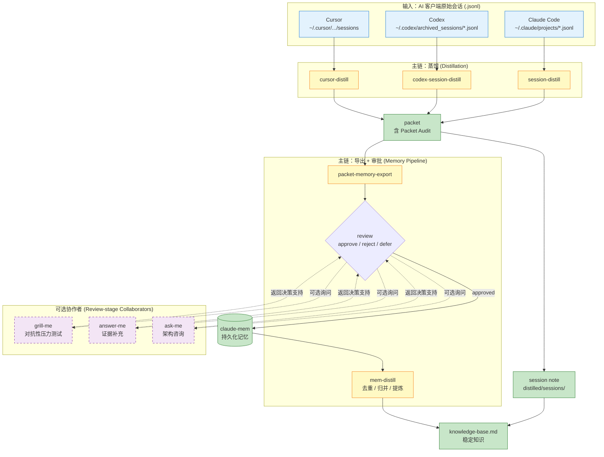

# Session Distill Skills

将 Claude Code / Codex / Cursor 的 AI 会话记录蒸馏为结构化知识，支持跨平台。

## 技能列表

### 主链 skill

| 技能 | 平台 | 说明 |
|------|------|------|
| `session-distill` | Claude Code | 核心蒸馏引擎：index -> bundle -> packet -> session note -> knowledge base |
| `codex-session-distill` | Codex | Codex 归档会话蒸馏 |
| `cursor-distill` | Cursor | Cursor 会话蒸馏 |

### 导出 + 审批 skill

| 技能 | 说明 |
|------|------|
| `packet-memory-export` | 从 packet 导出结构化 memory draft，支持 approve / reject / defer |

### 可选协作者（review-stage collaborators）

以下 skill 均 **可选**，不在默认蒸馏主链上，缺失时不应阻塞主链。都不写记忆、不批准条目、不替代 review 决策。

| 技能 | 用途 | 输出 |
|------|------|------|
| `mem-distill` | claude-mem 记忆去重/归并/提炼 | 稳定知识 -> knowledge-base.md |
| `grill-me` | 对抗性压力测试：候选结论是否过度概括 | keep / narrow / defer / reject + 失败模式 |
| `answer-me` | 证据补充：候选 draft 缺代码/文档/测试证据时 | 证据来源 + 支持的标签 (new/refine/confirm/conflict/ephemeral) |
| `ask-me` | 架构/路线图咨询：draft 触及更大的设计决策时 | 推荐方案 + 权衡 + 风险 + 依赖 |

## 架构图



### 设计要点

1. **三平台共用一套蒸馏模型**：原始 jsonl -> packet -> session note -> knowledge base
2. **主链单向流动**：不要在主链上做条件分支
3. **协作者虚线连接**：grill-me / answer-me / ask-me 只在 review 阶段被询问，不写记忆、不阻塞主链
4. **审批门控**：只有 approved 的条目才进入 claude-mem，避免污染长期记忆

## 工作流

```
原始会话 JSONL
    │
    ▼
session-distill run --next N     ← 生成 packet
    │
    ▼
AI 读取 packet + 写 session note  ← 蒸馏
    │
    ▼
packet-memory-export export       ← 导出 memory draft (可选)
    │
    ▼
审批 / 同步到 claude-mem          ← mem-distill (可选)
```

## 安装

```bash
# Claude Code
cp -r session-distill ~/.claude/skills/manhua/
cp -r packet-memory-export ~/.claude/skills/manhua/
cp -r mem-distill ~/.claude/skills/manhua/

# Codex
cp -r codex-session-distill ~/.codex/skills/manhua/session-distill/

# Cursor
cp -r cursor-distill ~/.cursor/skills/session-distill/
```

## 目录结构

```
session-distill-skills/
├── session-distill/          # Claude Code 核心蒸馏
│   ├── SKILL.md
│   ├── bin/session-distill.py
│   ├── references/
│   └── tests/
├── codex-session-distill/    # Codex 原生适配
│   ├── SKILL.md
│   ├── bin/session-distill.py
│   ├── references/
│   └── tests/
├── packet-memory-export/     # Memory draft 导出
│   ├── SKILL.md
│   ├── bin/packet-memory-export.py
│   └── tests/
├── mem-distill/              # 记忆蒸馏辅助
│   └── SKILL.md
├── cursor-distill/           # Cursor 蒸馏
│   └── bin/cursor-distill.py
├── grill-me/                 # 审查协作者：对抗性压力测试
│   └── SKILL.md
├── answer-me/                # 审查协作者：证据补充
│   └── SKILL.md
└── ask-me/                   # 审查协作者：架构咨询
    └── SKILL.md
```
