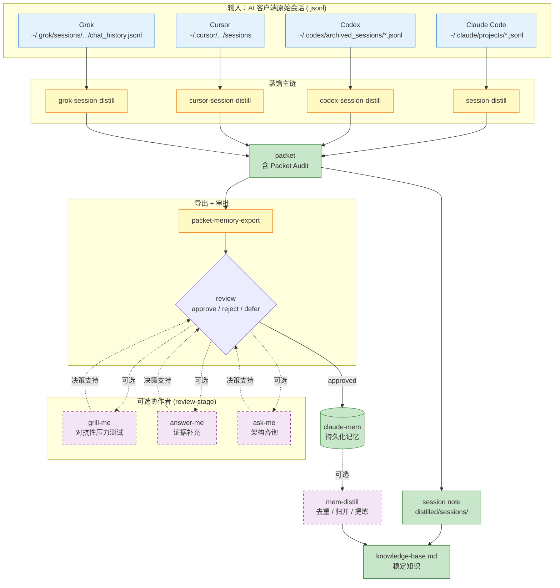

# Session Distill Skills

将 Claude Code / Codex / Cursor / Grok 的 AI 会话记录蒸馏为结构化知识，支持跨平台。

## 架构图



**设计要点**：主链单向流动；协作者虚线连接，不写记忆、不阻塞主链；只有 approved 的条目才进入 claude-mem。

## 技能列表

### 蒸馏主链

| 技能 | 平台 | 说明 |
|------|------|------|
| `session-distill` | Claude Code | 核心蒸馏引擎：index -> bundle -> packet -> session note -> knowledge base |
| `codex-session-distill` | Codex | Codex 归档会话蒸馏 |
| `cursor-session-distill` | Cursor | Cursor 会话蒸馏 |
| `grok-session-distill` | Grok CLI | Grok `chat_history.jsonl` 会话蒸馏 |
| `packet-memory-export` | Claude Code | 从 packet 导出结构化 memory draft，支持 approve / reject / defer |

### 可选协作者

均 **可选**，缺失时不应阻塞主链。不写记忆、不批准条目、不替代 review 决策。

| 技能 | 用途 | 输出 |
|------|------|------|
| `mem-distill` | claude-mem 记忆去重/归并/提炼 | 稳定知识 -> knowledge-base.md |
| `grill-me` | 对抗性压力测试：候选结论是否过度概括 | keep / narrow / defer / reject + 失败模式 |
| `answer-me` | 证据补充：draft 缺代码/文档/测试证据时 | 证据来源 + 支持标签 |
| `ask-me` | 架构/路线图咨询：draft 触及更大设计决策时 | 推荐方案 + 权衡 + 风险 |

## 安装

```bash
# Claude Code
cp -r session-distill ~/.claude/skills/manhua/
cp -r packet-memory-export ~/.claude/skills/manhua/
cp -r mem-distill ~/.claude/skills/manhua/
cp -r grill-me ~/.claude/skills/manhua/
cp -r answer-me ~/.claude/skills/manhua/
cp -r ask-me ~/.claude/skills/manhua/

# Codex
cp -r codex-session-distill ~/.codex/skills/manhua/session-distill/

# Cursor
cp -r cursor-session-distill ~/.cursor/skills/session-distill/

# Grok CLI
cp -r grok-session-distill ~/.grok/skills/session-distill/
```

## 目录结构

```
session-distill-skills/
├── session-distill/              # Claude Code 核心蒸馏
│   ├── SKILL.md
│   ├── bin/session-distill.py
│   ├── references/
│   └── tests/
├── codex-session-distill/        # Codex 归档会话蒸馏
│   ├── SKILL.md
│   ├── bin/session-distill.py
│   ├── references/
│   └── tests/
├── cursor-session-distill/       # Cursor 会话蒸馏
│   └── bin/cursor-session-distill.py
├── grok-session-distill/         # Grok CLI 会话蒸馏
│   ├── SKILL.md
│   ├── bin/grok-session-distill.py
│   ├── references/
│   └── tests/
├── packet-memory-export/         # Memory draft 导出 + 审批
│   ├── SKILL.md
│   ├── bin/packet-memory-export.py
│   └── tests/
├── mem-distill/                  # 可选：claude-mem 记忆整理
│   └── SKILL.md
├── grill-me/                     # 可选：对抗性压力测试
│   └── SKILL.md
├── answer-me/                    # 可选：证据补充
│   └── SKILL.md
└── ask-me/                       # 可选：架构咨询
    └── SKILL.md
```