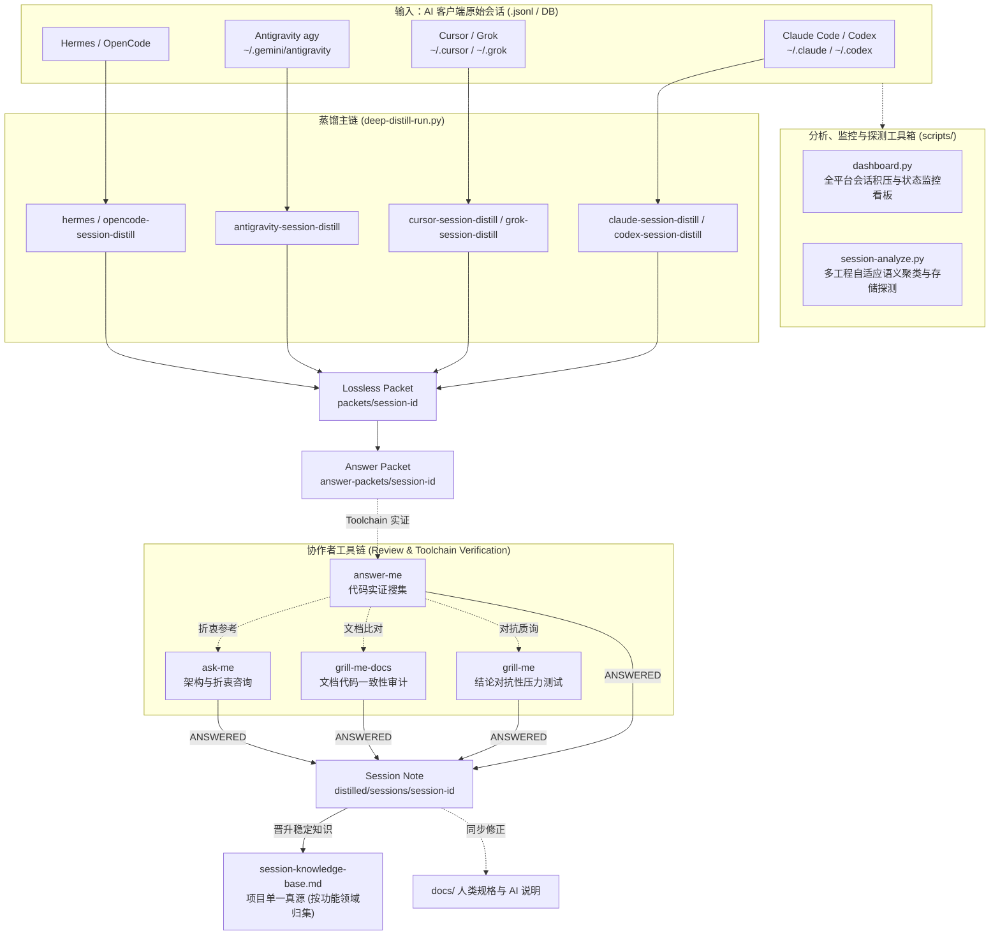

# Session Distill Skills (会话蒸馏技能库)

将 Claude Code / Codex / Cursor / Grok / Hermes / Antigravity / OpenCode 等 AI 客户端的原始会话记录蒸馏为可检验、无过时污染的项目结构化知识。

[English Documentation](README.md)

---

## 架构全景



---

## 核心工具集 (CLI Utilities)

仓库 `scripts/` 目录下提供了一套完整的工程化运维与分析工具：

### 1. 全平台监控看板 (`scripts/dashboard.py`)
实时汇总 7 大 AI 平台的会话总量、Packets、Answer Packets、已提炼数和待处理积压（Pending）：
```bash
# 查看所有平台全局状态
python scripts/dashboard.py

# 查看特定工程的会话处理状态
python scripts/dashboard.py --project servers
```

### 2. 多工程自适应语义分析与存储探测 (`scripts/session-analyze.py`)
支持按工程类型（后端、前端、逆向）动态自适应画像分类，并集成底层 SQLite 探查与安全清理：

```bash
# 1. 服务端业务会话语义分析（支持 8 大后端领域聚类）
python scripts/session-analyze.py --project servers

# 2. 客户端/前端工程分析（自动切换 UI/Gameplay/Asset/Protocol 等 6 大前端画像，过滤空草稿）
python scripts/session-analyze.py --project code --active-only

# 3. 逆向/安全分析（自动切换 Decompile/Crypto/Protocol 等 5 大逆向画像）
python scripts/session-analyze.py --project com-ican-raz

# 4. 探查 Cursor SQLite 物理存储、工作区映射与 DiskKV 键分布
python scripts/session-analyze.py --inspect-db

# 5. 安全清理已蒸馏工程的原始中间文件（Dry-run 预检与执行）
python scripts/session-analyze.py --project servers --clean-processed
python scripts/session-analyze.py --project servers --clean-processed --execute
```

#### 多工程技术画像（Taxonomy Profiles）对照

| 技术画像 | 适配场景 | 包含领域分类 |
|---|---|---|
| **`backend`（后端）** | 服务端、NestJS、微服务 | Payment & Commerce, Auth & User & SMS, Partner & Attribution & Marketing, Activity & Gameplay & Config, Database & Migration, Deployment & Ops & Infra, Multi-Product Architecture, Git & Code Review |
| **`frontend`（前端）** | Unity、Web、App 客户端 | UI & Visual & Animation, Gameplay & Battle Engine, Asset & Resource Pipeline, Network & Protocol Sync, Build & Platform SDK, Git & Code Review |
| **`reverse`（逆向）** | APK/DEX 解包、协议审计 | Decompile & DEX Recovery, Resource & Asset Extraction, Crypto & Sign & Security, Network Contract & API Reversal, Git & Automation Tooling |

### 3. 全量测试与质量防线 (`scripts/run-all-tests.py`)
一键运行全量自动化测试（7 大平台适配器 self-test + 契约测试 + 工具集自测 + 本地硬编码路径防御检查）：
```bash
python scripts/run-all-tests.py
```

### 4. 共享模块同步 (`scripts/sync-shared.py`)
将 `shared/` 核心库同步分发至各适配器目录并校验一致性：
```bash
python scripts/sync-shared.py --check
python scripts/sync-shared.py
```

---

## Deep Distill 蒸馏核心范式

所有平台统一通过共享核心库 `shared/deep_distill_lib.py` 执行后处理与门禁：

1. **小批次迭代**：`deep-distill-run.py --batch-size 3`。
2. **紧凑索引清单 (Compact Manifest Ingest)**：控制在 3000 Tokens 预算内，快速检索对话摘要。
3. **Answer Packet 强实证门禁**：知识假设 -> 问题表 -> 物理工具链代码实证 -> 仅 `ANSWERED` 行落盘晋升。
4. **时效性与历史时间差审计 (Temporal Staleness Audit)**：以当前最新代码库 HEAD 为唯一真理，重新核验历史 Claim，防过时知识污染。
5. **Check-work 审计报告**：标记完成前，生成 `distilled/check-work/batch-*-report.md` 审核日志。

---

## 支持的平台适配器

| 适配器 | 平台 | 原始数据格式 | 索引/查询优化 |
|---|---|---|---|
| `claude-session-distill` | Claude Code | `.jsonl` | 结构化 Session 扫描 |
| `codex-session-distill` | Codex | 归档 DB / JSONL | JSONL 会话拆分 |
| `cursor-session-distill` | Cursor | SQLite (`state.vscdb`) + JSONL | B-Tree 前缀范围索引优化 (0.05ms) + 自动过滤空草稿 |
| `grok-session-distill` | Grok CLI | `chat_history.jsonl` | 多轮对话分段重建 |
| `hermes-session-distill` | Hermes | SQLite `state.db` | 内存会话与状态机提取 |
| `antigravity-session-distill` | Antigravity (agy) | `history.jsonl` + brain transcripts | 会话轨迹与 Artifact 映射 |
| `opencode-session-distill` | OpenCode | `storage/session` JSON 树 | 多工作区目录树解析 |

---

## 一键安装

PowerShell 一键安装脚本：

```powershell
.\shared\install.ps1 -Platforms cursor,grok,hermes,antigravity
```

---

## 贡献与测试

提交 PR 前请确保全量测试通过：
```bash
python scripts/run-all-tests.py
```
详见 [CONTRIBUTING.md](CONTRIBUTING.md)。
