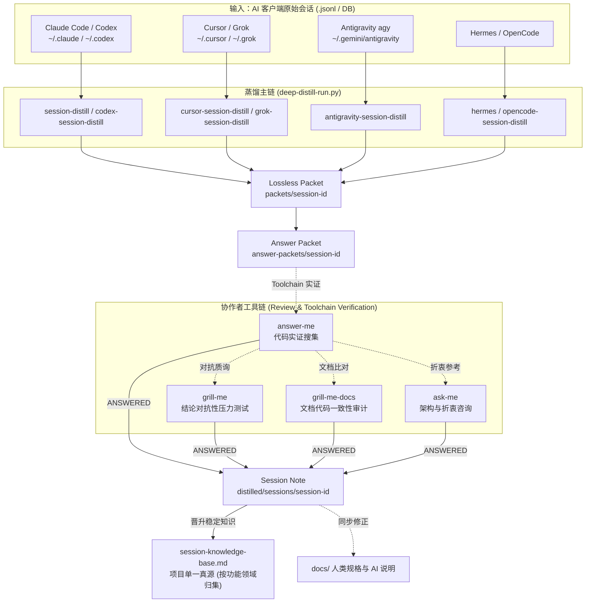

# Session Distill Skills (会话蒸馏技能库)

将 Claude Code / Codex / Cursor / Grok / Hermes / Antigravity / OpenCode 等 AI 客户端的原始会话记录蒸馏为可检验的项目结构化知识。

[English Documentation](README.md)

## 架构图



## Deep Distill 蒸馏核心范式

所有 7 大平台统一通过共享核心库 `shared/deep_distill_lib.py` 执行后处理与门禁：

1. **每批 3 条**：`deep-distill-run.py --batch-size 3`。
2. **紧凑索引清单 (Compact Manifest Ingest)**：控制在 3000 Tokens 预算内，快速检索对话摘要。
3. **Answer Packet 强实证门禁**：知识假设 -> 问题表 -> 物理工具链代码实证 -> 仅 `ANSWERED` 行落盘晋升。
4. **时效性与历史时间差审计 (Temporal Staleness Audit)**：以当前最新代码库 HEAD 为唯一真理，重新核验历史 Claim，防过时知识污染。
5. **Check-work 审计报告**：标记完成前，生成 `distilled/check-work/batch-*-report.md` 审核日志。

## 支持的平台适配器

| 适配器 | 平台 | 原始数据格式 |
|---|---|---|
| `session-distill` | Claude Code | `.jsonl` |
| `codex-session-distill` | Codex | 归档 DB / JSONL |
| `cursor-session-distill` | Cursor | SQLite + JSONL |
| `grok-session-distill` | Grok CLI | `chat_history.jsonl` |
| `hermes-session-distill` | Hermes | SQLite `state.db` |
| `antigravity-session-distill` | Antigravity (agy) | `history.jsonl` + brain transcripts |
| `opencode-session-distill` | OpenCode | `storage/session` JSON 树 |

## 可选协作者工具

均**可选**，缺失时不阻塞主链：
- `grill-me`：对抗性压力测试，校验结论是否过度概括。
- `grill-me-docs`：文档代码一致性审计。
- `answer-me`：补充代码/提交/配置实证。
- `ask-me`：架构咨询。

## 一键安装

PowerShell 一键安装脚本：

```powershell
.\shared\install.ps1 -Platforms cursor,grok,hermes,antigravity
```
